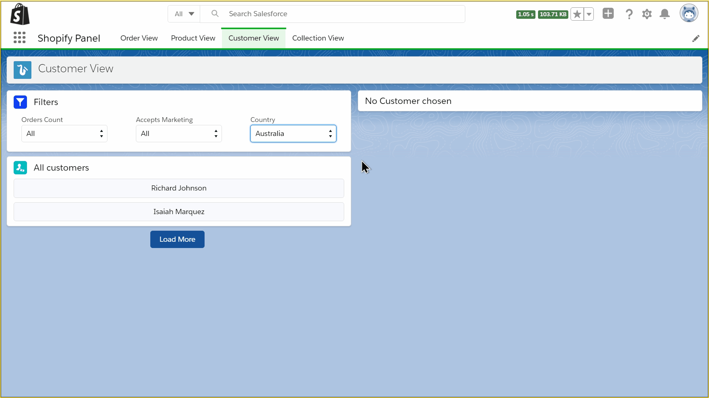

# Shopify Salesforce Integration

## What is it?
This is a Salesforce Lightning App, build using Aura Components with Shopify Admin API as data source.

## How does it look?


## What it can do?
It can fetch many different data items from Shopify store like; Customers, Collections, Products, Orders etc. Similar to any E-commerce platform it will display each of them in List view with filters for their common properties. Right half of the page is reserved for details of selected item from list view.

## How is it designed?
There are 4 different tabs for 4 different items respectively: Orders, Products, Customers & Collections. Each tab has a a single lightning page divided into two sections; left side for list view and filters while right side for details of item selected from list view.
Filters can be used to filter out the items shown in list view. Clicking on a list item will display its detailed information in right side component.
List view will only load 5 items at once, clicking on 'Load More' button will load further items(if any).

## How to run it?
1. Install SFDX CLI.
2. Sign up for a new Developer account on [Salesforce](https://developer.salesforce.com).
3. Insall [VS-Code](https://code.visualstudio.com)(Optional).
4. Clone this repository:
```
git clone https://github.com/manishSbisht/Shopify-Salesforce-Integration.git
cd Shopify-Salesforce-Integration
```
5. Authorize your Dev account, provide something for alias('anythingXYZ' in command below):
```
sfdx force:auth:web:login --setalias anythingXYZ --instanceurl https://login.salesforce.com --setdefaultusername
```
6. Push this source code from your local machine to cloud:
```
sfdx force:source:deploy
```
7. Open your org with:
```
sfdx force:org:open
```
8. Open in VS code editor with:
```
code .
```